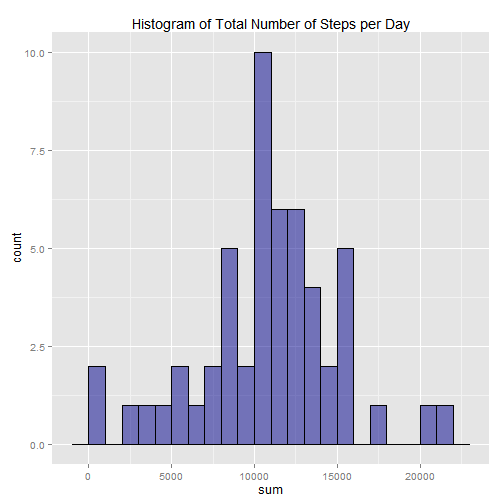
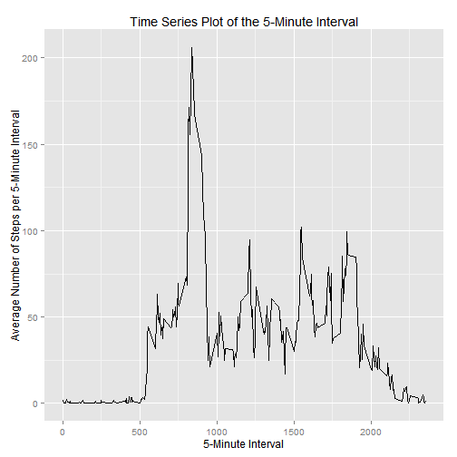
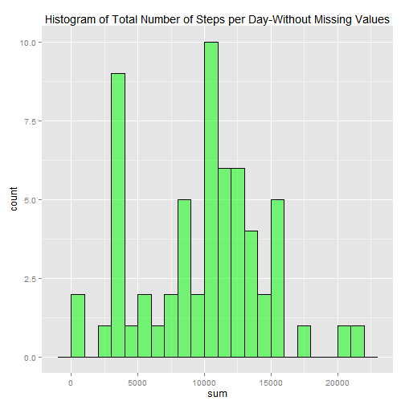
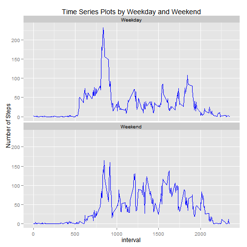

# Reproducible Research: Peer Assessment 1

load packages

```r
library(data.table)
```

```
## Warning: package 'data.table' was built under R version 3.0.3
```

```
## data.table 1.9.2  For help type: help("data.table")
```

```r
library(ggplot2)
```

```
## Warning: package 'ggplot2' was built under R version 3.0.3
```

```r
library(xtable)
library(dplyr)
```

```
## Warning: package 'dplyr' was built under R version 3.0.3
```

```
## 
## Attaching package: 'dplyr'
## 
## The following object is masked from 'package:data.table':
## 
##     last
## 
## The following objects are masked from 'package:stats':
## 
##     filter, lag
## 
## The following objects are masked from 'package:base':
## 
##     intersect, setdiff, setequal, union
```

## Loading and preprocessing the data

```r
setwd("C:/Users/Nathan/RepData_PeerAssessment1")
list.files()
```

```
## [1] "activity.csv"      "activity.zip"      "doc"              
## [4] "instructions_fig"  "PA1_template.html" "PA1_template.Rmd" 
## [7] "README.md"
```

```r
activity<-read.csv("activity.csv")
head(activity)
```

```
##   steps       date interval
## 1    NA 2012-10-01        0
## 2    NA 2012-10-01        5
## 3    NA 2012-10-01       10
## 4    NA 2012-10-01       15
## 5    NA 2012-10-01       20
## 6    NA 2012-10-01       25
```

```r
summary(activity)
```

```
##      steps               date          interval   
##  Min.   :  0.0   2012-10-01:  288   Min.   :   0  
##  1st Qu.:  0.0   2012-10-02:  288   1st Qu.: 589  
##  Median :  0.0   2012-10-03:  288   Median :1178  
##  Mean   : 37.4   2012-10-04:  288   Mean   :1178  
##  3rd Qu.: 12.0   2012-10-05:  288   3rd Qu.:1766  
##  Max.   :806.0   2012-10-06:  288   Max.   :2355  
##  NA's   :2304    (Other)   :15840
```

```r
str(activity)
```

```
## 'data.frame':	17568 obs. of  3 variables:
##  $ steps   : int  NA NA NA NA NA NA NA NA NA NA ...
##  $ date    : Factor w/ 61 levels "2012-10-01","2012-10-02",..: 1 1 1 1 1 1 1 1 1 1 ...
##  $ interval: int  0 5 10 15 20 25 30 35 40 45 ...
```

```r
View(activity)
```

Convert the data to a tbl_df  
It's worthwhile to convert large datasets to tbl_df


```r
activity_df<-tbl_df(activity)
activity_df
```

```
## Source: local data frame [17,568 x 3]
## 
##    steps       date interval
## 1     NA 2012-10-01        0
## 2     NA 2012-10-01        5
## 3     NA 2012-10-01       10
## 4     NA 2012-10-01       15
## 5     NA 2012-10-01       20
## 6     NA 2012-10-01       25
## 7     NA 2012-10-01       30
## 8     NA 2012-10-01       35
## 9     NA 2012-10-01       40
## 10    NA 2012-10-01       45
## ..   ...        ...      ...
```

Group the data by date


```r
activity_date<-group_by(activity_df,date)
```

Summarise the grouped data by total number of steps taken per day

```r
stepsPerDay<-summarise(activity_date, sum=sum(steps, na.rm=FALSE))
head(stepsPerDay,n=5)
```

```
## Source: local data frame [5 x 2]
## 
##         date   sum
## 1 2012-10-01    NA
## 2 2012-10-02   126
## 3 2012-10-03 11352
## 4 2012-10-04 12116
## 5 2012-10-05 13294
```

## What is mean total number of steps taken per day?

Calculate the mean and median of total number of steps from "stepsPerDay"

```r
meanSteps<-mean(stepsPerDay$sum, na.rm=TRUE)
meanSteps
```

```
## [1] 10766
```

```r
medianSteps<-median(stepsPerDay$sum, na.rm=TRUE)
medianSteps
```

```
## [1] 10765
```

Create a Histogram of the total number of steps per day

```r
h<-ggplot(stepsPerDay, aes(x=sum))+
        geom_histogram(alpha=1/2,binwidth=1000,fill="darkblue",color="black")
h+ggtitle("Histogram of Total Number of Steps per Day")                      
```

 

## What is the average daily activity pattern?

Group the data by interval

```r
intervalGrp<-group_by(activity,interval)
head(intervalGrp)
```

```
## Source: local data frame [6 x 3]
## Groups: interval
## 
##   steps       date interval
## 1    NA 2012-10-01        0
## 2    NA 2012-10-01        5
## 3    NA 2012-10-01       10
## 4    NA 2012-10-01       15
## 5    NA 2012-10-01       20
## 6    NA 2012-10-01       25
```

```r
View(intervalGrp)
```

Claculate the average number of steps taken per time interval

```r
AvrgStepsIntvl<-summarise(intervalGrp,Average=mean(steps,na.rm=TRUE))
View(AvrgStepsIntvl)
```

Make a time series plot

```r
ts<-ggplot(AvrgStepsIntvl, aes(x=interval, y=Average))+geom_line(alpha=1,binwidth=5)
ts+ggtitle("Time Series Plot of the 5-Minute Interval")+xlab("5-Minute Interval")+
        ylab("Average Number of Steps per 5-Minute Interval")
```

 

## Imputing missing values

Calculate the total number of missing values

```r
summary(activity$steps)
```

   Min. 1st Qu.  Median    Mean 3rd Qu.    Max.    NA's 
    0.0     0.0     0.0    37.4    12.0   806.0    2304 

input missing values

```r
##use the "vIM" package to input missing values
library(VIM)
```

```
## Warning: package 'VIM' was built under R version 3.0.3
```

```
## Loading required package: colorspace
## Loading required package: grid
## VIM is ready to use. 
##  Since version 4.0.0 the GUI is in its own package VIMGUI.
## 
##           Please use the package to use the new (and old) GUI.
## 
## 
## Attaching package: 'VIM'
## 
## The following object is masked from 'package:datasets':
## 
##     sleep
```

```r
##Use k-Nearest Neighbour Imputation (kNN) method to imput missing values
activity2<-kNN(activity)
```

```
## Time difference of -14.5 secs
```

```r
summary(activity2)
```

```
##      steps               date          interval    steps_imp      
##  Min.   :  0.0   2012-10-01:  288   Min.   :   0   Mode :logical  
##  1st Qu.:  0.0   2012-10-02:  288   1st Qu.: 589   FALSE:15264    
##  Median :  0.0   2012-10-03:  288   Median :1178   TRUE :2304     
##  Mean   : 33.9   2012-10-04:  288   Mean   :1178   NA's :0        
##  3rd Qu.:  9.0   2012-10-05:  288   3rd Qu.:1766                  
##  Max.   :806.0   2012-10-06:  288   Max.   :2355                  
##                  (Other)   :15840
```

Create a new data set with missing data filled in

```r
New_activity<-select(activity2, steps,date,interval)
summary(New_activity)
```

```
##      steps               date          interval   
##  Min.   :  0.0   2012-10-01:  288   Min.   :   0  
##  1st Qu.:  0.0   2012-10-02:  288   1st Qu.: 589  
##  Median :  0.0   2012-10-03:  288   Median :1178  
##  Mean   : 33.9   2012-10-04:  288   Mean   :1178  
##  3rd Qu.:  9.0   2012-10-05:  288   3rd Qu.:1766  
##  Max.   :806.0   2012-10-06:  288   Max.   :2355  
##                  (Other)   :15840
```

Calculate the New mean and median of total number of steps 

```r
New_activity_date<-group_by(New_activity,date)
New_stepsPerDay<-summarise(New_activity_date, sum=sum(steps))
New_meanSteps<-mean(New_stepsPerDay$sum)
New_meanSteps
```

```
## [1] 9752
```

```r
New_medianSteps<-median(New_stepsPerDay$sum)
New_medianSteps
```

```
## [1] 10395
```

Create a NEW Histogram of the total number of steps per day

```r
h<-ggplot(New_stepsPerDay, aes(x=sum))+
        geom_histogram(alpha=1/2,binwidth=1000,fill="green",color="black")
h+ggtitle("Histogram of Total Number of Steps per Day-Without Missing Values")
```

 

Do these values differ from the estimates from the first part of Assignment  
-Yes, the data with the missing values over estimates the mean and the median as shown below

```r
meanSteps
```

[1] 10766

```r
New_meanSteps
```

[1] 9752

```r
medianSteps
```

[1] 10765

```r
New_medianSteps
```

[1] 10395

What is the impact of imputing missing values on the estimates  
-Inputing missing values reduces the tendency of over estimating parameters such as the mean,
median, percentiles, and others

## Are there differences in activity patterns between weekdays and weekends?

Create a new factor variable with "weekday" and "weekend" levels

```r
##create new variable(day) for day of the week
New_activity1<-New_activity
New_activity1$day<-weekdays(as.Date(New_activity1$date,"%Y-%m-%d"))

##Now create new variable for weekends/weekdays
library(chron)
```

```
## Warning: package 'chron' was built under R version 3.0.3
```

```r
New_activity2<-New_activity1
New_activity2$week<-is.weekend(New_activity1$date)
New_activity2$week1<-ifelse(New_activity2$week=="FALSE", "Weekday" ,"Weekend")
summary(New_activity2)
```

```
##      steps               date          interval        day           
##  Min.   :  0.0   2012-10-01:  288   Min.   :   0   Length:17568      
##  1st Qu.:  0.0   2012-10-02:  288   1st Qu.: 589   Class :character  
##  Median :  0.0   2012-10-03:  288   Median :1178   Mode  :character  
##  Mean   : 33.9   2012-10-04:  288   Mean   :1178                     
##  3rd Qu.:  9.0   2012-10-05:  288   3rd Qu.:1766                     
##  Max.   :806.0   2012-10-06:  288   Max.   :2355                     
##                  (Other)   :15840                                    
##     week            week1          
##  Mode :logical   Length:17568      
##  FALSE:12960     Class :character  
##  TRUE :4608      Mode  :character  
##  NA's :0                           
##                                    
##                                    
## 
```

```r
New_activity2$week1<-as.factor(New_activity2$week1)
str(New_activity2)
```

```
## 'data.frame':	17568 obs. of  6 variables:
##  $ steps   : num  0 0 0 0 0 0 0 0 0 0 ...
##  $ date    : Factor w/ 61 levels "2012-10-01","2012-10-02",..: 1 1 1 1 1 1 1 1 1 1 ...
##  $ interval: int  0 5 10 15 20 25 30 35 40 45 ...
##  $ day     : chr  "Monday" "Monday" "Monday" "Monday" ...
##  $ week    : logi  FALSE FALSE FALSE FALSE FALSE FALSE ...
##  $ week1   : Factor w/ 2 levels "Weekday","Weekend": 1 1 1 1 1 1 1 1 1 1 ...
```

Make a panel plot containing a time series plot

Group the new data by interval

```r
New_intervalGrp<-group_by(New_activity2,interval,week1)
head(New_intervalGrp)
```

```
## Source: local data frame [6 x 6]
## Groups: interval, week1
## 
##   steps       date interval    day  week   week1
## 1     0 2012-10-01        0 Monday FALSE Weekday
## 2     0 2012-10-01        5 Monday FALSE Weekday
## 3     0 2012-10-01       10 Monday FALSE Weekday
## 4     0 2012-10-01       15 Monday FALSE Weekday
## 5     0 2012-10-01       20 Monday FALSE Weekday
## 6     0 2012-10-01       25 Monday FALSE Weekday
```

Claculate the average number of steps taken per time interval

```r
New_AvrgStepsIntvl<-summarise(New_intervalGrp,Average=mean(steps))
head(New_AvrgStepsIntvl)
```

```
## Source: local data frame [6 x 3]
## Groups: interval
## 
##   interval   week1 Average
## 1        0 Weekday  2.0222
## 2        0 Weekend  0.0000
## 3        5 Weekday  0.4000
## 4        5 Weekend  0.0000
## 5       10 Weekday  0.1556
## 6       10 Weekend  0.0000
```

Make a time series plot

```r
ts<-ggplot(New_AvrgStepsIntvl, aes(x=interval, y=Average))+geom_line(color="blue")
ts+facet_wrap(~week1,nrow=2)+theme(legend.position="none")+
        ggtitle("Time Series Plots by Weekday and Weekend")+ylab("Number of Steps")
```

 

This is the end of the Assignment.
